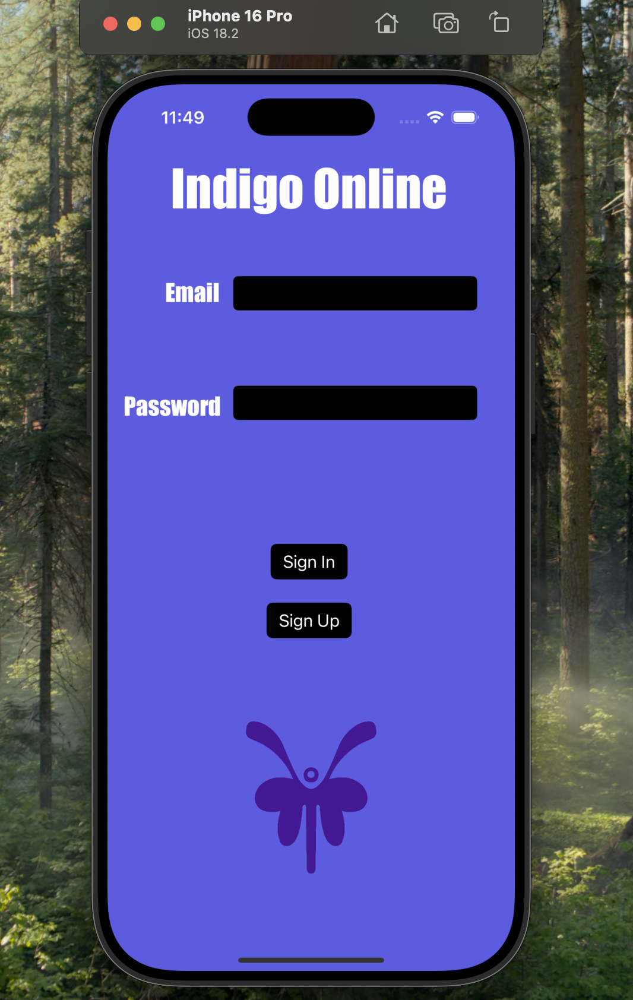
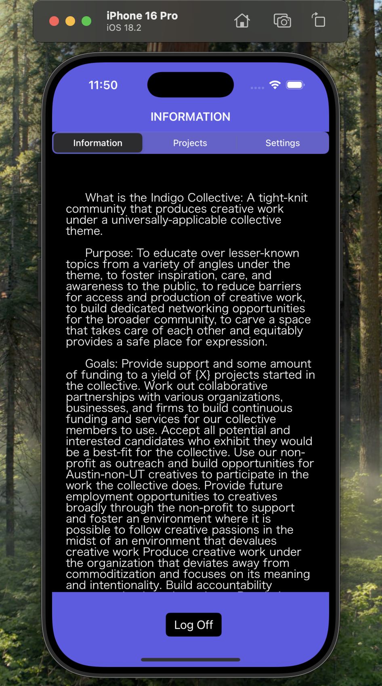
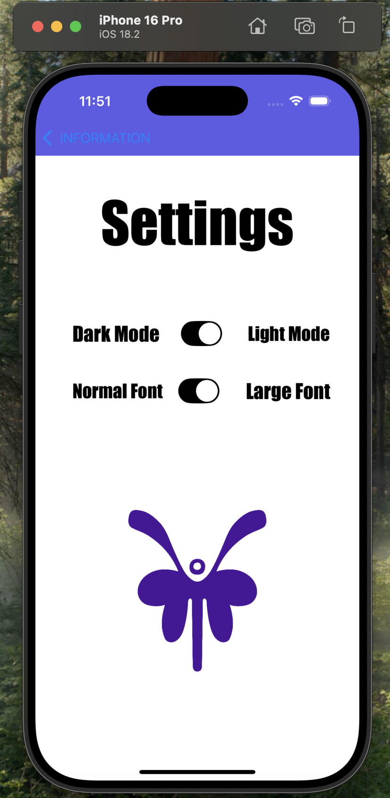
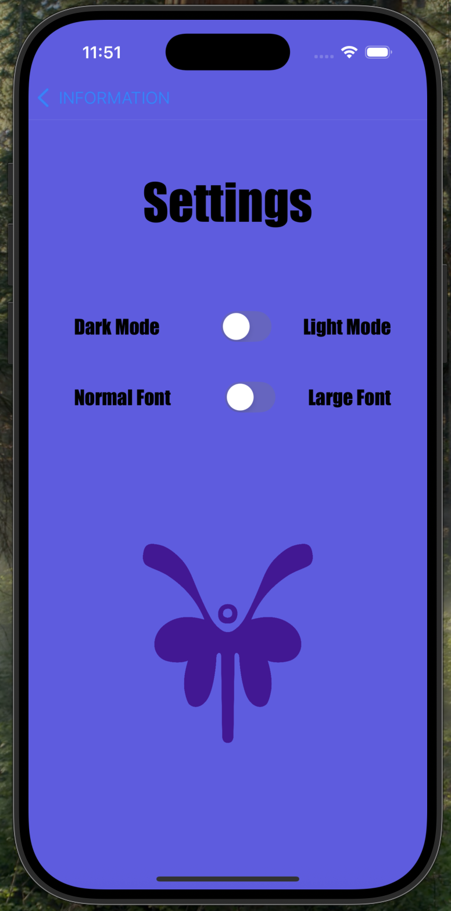

# indigo-ios-app

This is a document/project manager app built with Swift and Firebase for members of the Indigo Collective at UT Austin. The app was created to help users learn about the organization, explore how the collective is run, and view current projects in a visually engaging and accessible way.

- Built using Xcode 16.1 and Swift 5 with a mix of Storyboard and SwiftUI for UI design and screen functionality
- Uses Firebase for login, registration, and database storage  
- Optimized for iPhone 16 Pro (also works on iPhone 16 and iPhone 16 Pro Max)  
- Best used in portrait mode for smooth reading and scrolling  
- Includes working login/register path with Firebase (test account: jenna@nega.com, password: rainbows)  
- Settings screen includes light/dark mode toggle and font size adjustment  
- Built with SwiftUI for settingsVC and UIKit for table views and navigation  
- UI includes segmented controls, toggles, alerts for auth errors, and a local push notification after login  
- Design uses bold colors and custom fonts while keeping table views simple for readability

This app is a colorful and functional introduction to the Indigo Collective and was developed with care to create a user-friendly experience with strong backend integration.

# Screenshots

  
  
  
  

